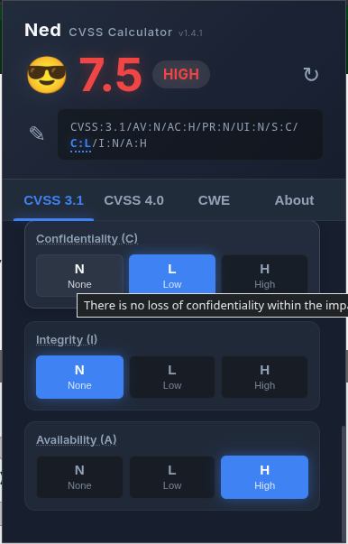
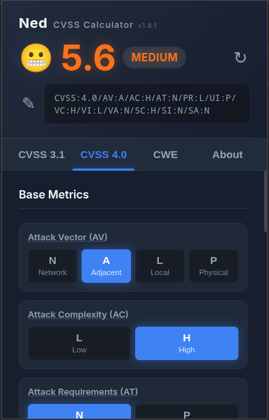
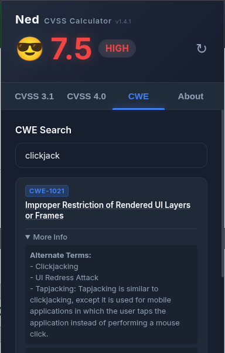

# Ned - CVSS Calculator

Ned is a locally-run, browser extension for calculating Common Vulnerability Scoring System (CVSS) v3.1 and v4.0 scores directly from your popup. Designed with privacy in mind, all official FIRST.org and Red Hat javascript calculations run entirely offline.

## Features

- **CVSS v3.1 & v4.0 Support**: Calculate scores using standard metrics for both versions.
- **MITRE CWE Offline Search**: Quickly map vulnerabilities using the built-in, offline fuzzy search tab (includes hover descriptions for weaknesses).
- **Privacy-First (Offline)**: All calculations and searches run locally in your browser. No external API calls are made.
- **Copy Vector Strings / IDs**: A single click instantly copies a vector string or a CWE ID to your clipboard.
- **Edit & Parse Strings**: Double-click or click the edit icon to paste preexisting vector strings, updating all the metric UI buttons dynamically.
- **State Saving**: The extension remembers your previous score calculations and tab selection even when closed.

### Previews

  
  
  

## Installation

### Official Stores

The easiest way to install Ned is to download it directly from your browser's official extension store:

Install on Chrome/Edge/Brave: [Chrome Web Store](https://chromewebstore.google.com/detail/ned-cvss-calculator/ociocfepdnpdfjllilphdddkkelmpnkd)
Install on Firefox: [Firefox Add-ons](https://addons.mozilla.org/en-GB/firefox/addon/ned-cvss-calculator/)

### Manual Installation (Development)

#### Chromium (Chrome, Brave, Edge, etc.)
1. Clone or download this repository.
2. Open your chromium-based browser and navigate to `chrome://extensions/` (or `edge://extensions/` for Microsoft Edge).
3. Enable **Developer mode** in the top right corner.
4. Click **Load unpacked** and select the folder containing this extension's code.

#### Firefox
1. Clone or download this repository.
2. Open Firefox and navigate to `about:debugging`.
3. Click on **This Firefox** in the sidebar.
4. Click **Load Temporary Add-on...** and select the `manifest.json` file from the downloaded folder.

## Credits & Acknowledgements

- Built by **br0wnboi**
- [CVSS v3.1 Calculator Module](https://www.first.org/cvss/calculator/cvsscalc31.js) - Copyright (c) 2019, FIRST.ORG, INC. (BSD-2-Clause)
- [CVSS v4.0 Calculator Module](https://github.com/RedHatProductSecurity/cvss-v4-calculator) - Copyright FIRST, Red Hat, and contributors. (SPDX: BSD-2-Clause)
- [Fuse.js](https://fusejs.io) - Copyright (c) 2024 Kiro Risk (Apache-2.0)

## License

This project is licensed under the [MIT License](LICENSE).
