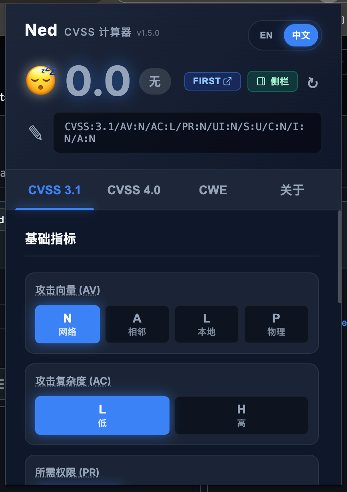
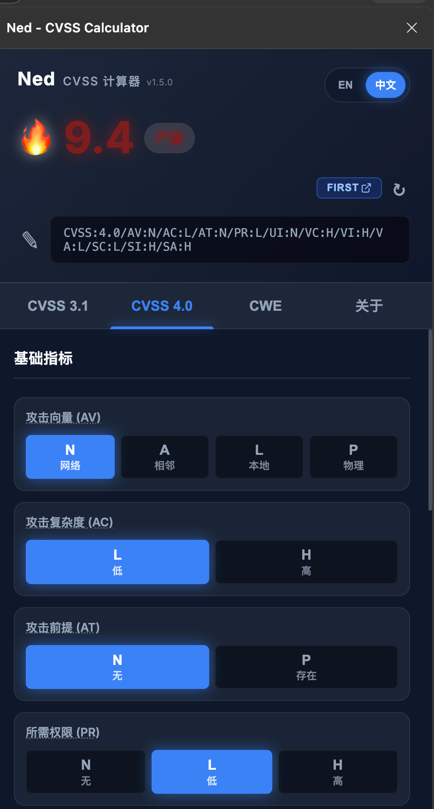

# Ned - CVSS 计算器

[English](README.md) | [简体中文](README_CN.md)

Ned 是一个本地运行的浏览器扩展，用于直接在弹窗中计算 Common Vulnerability Scoring System（CVSS）v3.1 与 v4.0 分数。它以隐私优先为设计目标，内置的 FIRST.org 与 Red Hat JavaScript 计算逻辑全部离线执行。

## 功能特性

- **支持 CVSS v3.1 与 v4.0**：使用标准指标计算两个版本的分数。
- **中英文切换**：在弹窗与隐私页之间切换英文和简体中文界面。
- **支持常驻侧栏**：可在 Edge、Firefox 与 Chrome 116+ 的浏览器侧栏中打开 Ned，便于长时间对照评分。
- **离线 MITRE CWE 检索**：通过内置的离线模糊搜索页快速定位弱点条目，并支持悬浮查看描述。
- **隐私优先（完全离线）**：所有计算与检索都在浏览器本地完成，不会调用外部 API。
- **复制向量字符串 / CWE ID**：单击即可复制向量字符串或 CWE 编号。
- **编辑与解析向量字符串**：双击或点击编辑按钮即可粘贴现有向量字符串，并自动同步更新指标按钮状态。
- **状态保存**：关闭后会保留上一次的分数计算状态和当前标签页。

### 预览
<div style="display: flex; flex-direction: row; gap: 10px;">
  
  
</div>

## 安装方式

### 官方商店

最简单的安装方式是直接通过浏览器官方扩展商店下载 Ned：

- Chrome / Brave / Chromium：[Chrome Web Store](https://chromewebstore.google.com/detail/ned-cvss-calculator/ociocfepdnpdfjllilphdddkkelmpnkd)
- Microsoft Edge：[Microsoft Edge Addons](https://microsoftedge.microsoft.com/addons/detail/ned-cvss-calculator/nfjninogbnocfmijciibgckgpkpfbgii)
- Firefox：[Firefox Add-ons](https://addons.mozilla.org/en-GB/firefox/addon/ned-cvss-calculator/)

### 手动安装（开发模式）

先生成浏览器专用构建：

```bash
python3 scripts/build_variants.py
```

#### Chromium（Chrome、Brave、Edge 等）
1. 克隆或下载本仓库。
2. 打开基于 Chromium 的浏览器，进入 `chrome://extensions/`（Microsoft Edge 使用 `edge://extensions/`）。
3. 打开右上角的 **Developer mode**。
4. 点击 **Load unpacked**，选择 `dev/chromium` 目录。
5. 打开扩展弹窗并点击 **侧栏**，即可切换到浏览器侧栏。Chrome 需要 116 及以上版本才能从弹窗直接打开侧栏。Chrome 与 Edge 可在浏览器侧栏设置中选择显示在左侧或右侧。

#### Firefox
1. 克隆或下载本仓库。
2. 打开 Firefox，进入 `about:debugging`。
3. 在侧边栏点击 **This Firefox**。
4. 点击 **Load Temporary Add-on...**，选择 `dev/firefox/manifest.json`。
5. 打开扩展弹窗并点击 **侧栏**，即可切换到 Firefox 内置侧栏。

## 鸣谢

- 作者：**br0wnboi**
- [CVSS v3.1 Calculator Module](https://www.first.org/cvss/calculator/cvsscalc31.js) - Copyright (c) 2019, FIRST.ORG, INC. (BSD-2-Clause)
- [CVSS v4.0 Calculator Module](https://github.com/RedHatProductSecurity/cvss-v4-calculator) - Copyright FIRST, Red Hat, and contributors. (SPDX: BSD-2-Clause)
- [Fuse.js](https://fusejs.io) - Copyright (c) 2024 Kiro Risk (Apache-2.0)

## 许可证

本项目基于 [MIT License](LICENSE) 发布。
